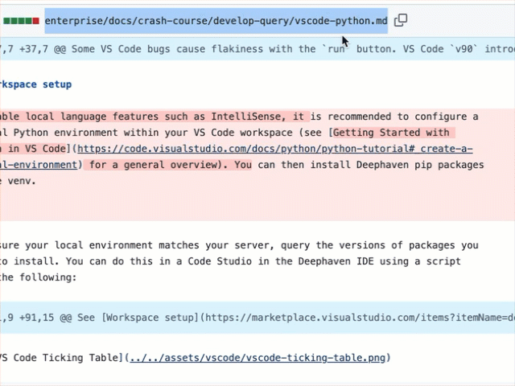

# Deephaven Dev Tools Chrome Extension

Deephaven Internal devlopment Chrome extensions.

## Extensions

Extensions are separated into subfolders in this repo:

- [/deephaven-docs](deephaven-docs) - Open Deephaven Docs Preview - right-click context menu item to open doc preview links from Github PRs

  

- [/deephaven-jira](deephaven-jira) - Highlight required fields in Jira tasks

- [/deephaven-vdo](deephaven-vdo) - Show username overlays for VDO Ninja calls

## Installation

- Clone this repo

> Note that there are multiple extensions in this repo. You can install any of them you are interested in.

- In Chrome, navigate to `chrome://extensions`
- Enable `Developer Mode` toggle in top right
- Click `Load upacked` button
- Select folder containing extension you want to install ([/deephaven-docs](deephaven-docs), [/deephaven-jira](deephaven-jira), etc.)

  
